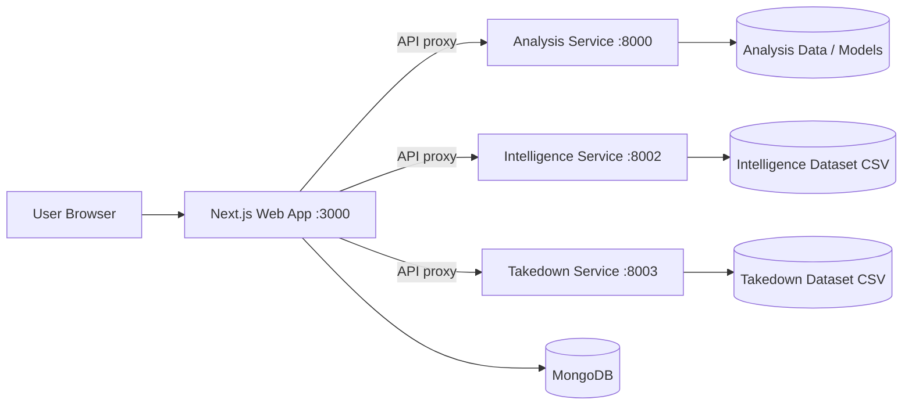
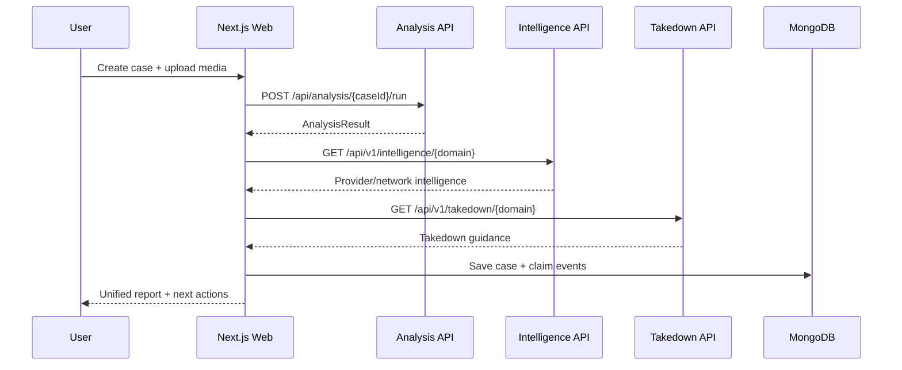
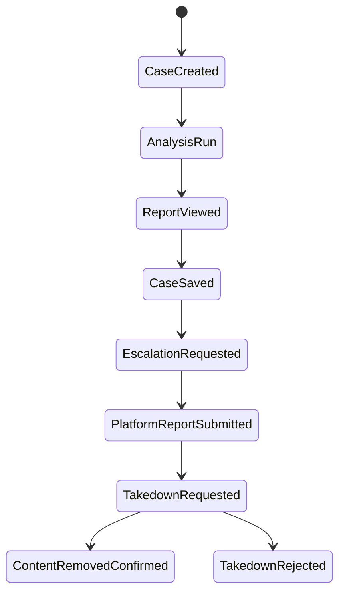

# Sniffer

Digital media authenticity and takedown intelligence platform for high-risk image abuse scenarios.

Sniffer helps users and investigators:

- detect potentially manipulated or deepfake images,
- preserve evidence with structured case workflows,
- map platform infrastructure intelligence,
- generate and track takedown actions.

---

## 1. Hackathon Submission Snapshot

### Problem
Victims and investigators dealing with manipulated or non-consensual imagery face fragmented workflows: verify authenticity, collect admissible evidence, identify distribution infrastructure, and perform platform takedowns.

### Solution
Sniffer unifies the entire response lifecycle in one product:

- **Verification**: AI + forensic analysis pipeline,
- **Case management**: claim tracking and event timelines,
- **Intelligence**: domain-to-provider/network mapping,
- **Takedown guidance**: contact vectors and removal playbooks,
- **Evidence output**: report-oriented architecture with auditable metadata.

### Why It Is Valuable

- compresses response time from hours to minutes,
- removes context switching between multiple tools,
- supports both technical and non-technical users.

---

## 2. Product Capabilities

### End-to-End Workflow

1. User creates a case.
2. User uploads suspicious media (and optional reference media).
3. Analysis service runs hybrid pipeline and returns report data.
4. Intelligence service enriches domain/provider/network context.
5. Takedown service returns actionable removal channels.
6. Web app stores events and presents dashboard telemetry.

### Core Features

- **Deepfake and tamper analysis** via FastAPI analysis engine.
- **Case lifecycle tracking** with claim events and metrics.
- **Platform intelligence lookup** from curated datasets.
- **Takedown guidance and fallback live scrape** when dataset misses.
- **Email/passwordless auth** via NextAuth + MongoDB adapter.
- **Dashboard with evidence and lifecycle visibility**.

---

## 3. Architecture

### System Topology



### Runtime Interaction



### Submission-Ready Monorepo Layout

```text
sniffer/
	apps/
		web/                  # Next.js frontend + API routes + auth + dashboard
	services/
		analysis/             # AI/forensic verification API (FastAPI)
		intelligence/         # Domain/provider/network intelligence API (FastAPI)
		takedown/             # Removal guidance API + scrape fallback (FastAPI)
	data/
		takedown.csv
```

---

## 4. Tech Stack

### Frontend

- Next.js 16 (App Router)
- React 19
- TypeScript
- Tailwind CSS
- NextAuth v5 beta + Nodemailer

### Backend

- Python 3.11+
- FastAPI + Uvicorn
- Pydantic

### Data and Persistence

- MongoDB (cases, user saves, claim events, metrics)
- CSV datasets for intelligence and takedown services

### Monorepo Tooling

- pnpm workspaces
- concurrently

---

## 5. API Surface

## 5.1 Analysis Service (`services/analysis`)

Base URL: `http://localhost:8000`

| Method | Endpoint | Purpose |
|---|---|---|
| POST | `/api/cases/` | Create case |
| GET | `/api/cases/{case_id}` | Get case |
| POST | `/api/analysis/{case_id}/run` | Run authenticity analysis |
| GET | `/api/analysis/{case_id}/result` | Fetch stored analysis result |
| POST | `/api/analysis/{case_id}/discover` | Start async discovery scan |
| GET | `/api/analysis/{case_id}/discover` | Read discovery status/result |
| POST | `/api/registry/` | Register original image |
| GET | `/api/registry/` | List registry entries |
| GET | `/api/registry/check/{file_hash}` | Hash verification |
| POST | `/api/registry/takedown-notice` | Generate notice text |
| GET | `/api/dashboard/` | Service analytics mock |
| GET | `/health` | Health check |

## 5.2 Intelligence Service (`services/intelligence`)

Base URL: `http://localhost:8002`

| Method | Endpoint | Purpose |
|---|---|---|
| GET | `/api/v1/intelligence/{domain}` | Domain intelligence lookup |
| GET | `/api/v1/intelligence/` | Dataset stats |
| GET | `/health` | Health check |

## 5.3 Takedown Service (`services/takedown`)

Base URL: `http://localhost:8003`

| Method | Endpoint | Purpose |
|---|---|---|
| GET | `/api/v1/takedown/{domain}` | Takedown guidance lookup |
| GET | `/api/v1/takedown/` | Dataset stats |
| GET | `/health` | Health check |

## 5.4 Web API Routes (`apps/web/app/api`)

- `/api/cases/*` proxies/fetches case data.
- `/api/intelligence/[domain]` proxies intelligence service.
- `/api/takedown/[domain]` proxies takedown service.
- `/api/user/cases` lists/checks/deletes user-saved cases.
- `/api/dashboard/overview` aggregates case and event telemetry.

---

## 6. Evidence and Case Lifecycle Model



This lifecycle is reflected in dashboard analytics through event-type classification and evidence coverage metrics.

---

## 7. Local Development Setup

### Prerequisites

- Node.js 20+
- pnpm 9+
- Python 3.11+

### Install Dependencies

```bash
pnpm install

# Create root virtual environment
python -m venv .venv

# Windows
.venv\Scripts\activate

# macOS/Linux
source .venv/bin/activate

# Install Python dependencies for all services
pip install -r services/analysis/requirements.txt
pip install -r services/intelligence/requirements.txt
pip install -r services/takedown/requirements.txt
```

### Run All Services (development)

```bash
pnpm dev
```

This starts:

- Web on `:3000`
- Analysis on `:8000`
- Intelligence on `:8002`
- Takedown on `:8003`

### Run Individually

```bash
pnpm dev:web
pnpm dev:api
pnpm dev:intel
pnpm dev:takedown
```

---

## 8. Environment Variables

Create environment files for each service.

### Web (`apps/web/.env.local` or `.env.production`)

| Variable | Required | Purpose |
|---|---|---|
| `MONGODB_URI` | Yes | MongoDB connection string |
| `NEXT_PUBLIC_API_URL` | Yes | Analysis API base URL (default localhost:8000 fallback) |
| `INTELLIGENCE_SERVICE_URL` | Yes | Internal intelligence service URL |
| `TAKEDOWN_SERVICE_URL` | Yes | Internal takedown service URL |
| `EMAIL_SERVER_HOST` | If email auth enabled | SMTP host |
| `EMAIL_SERVER_PORT` | If email auth enabled | SMTP port |
| `EMAIL_SERVER_USER` | If email auth enabled | SMTP username |
| `EMAIL_SERVER_PASSWORD` | If email auth enabled | SMTP password |
| `EMAIL_FROM` | If email auth enabled | Sender email |
| `NEXTAUTH_URL` | Production | Public app URL |
| `NEXTAUTH_SECRET` | Production | Session/auth secret |

### Analysis (`services/analysis/.env`)

| Variable | Required | Purpose |
|---|---|---|
| `HF_TOKEN` | Optional/Model-specific | Hugging Face model access |

### Intelligence (`services/intelligence/.env`)

| Variable | Required | Purpose |
|---|---|---|
| `INTELLIGENCE_PORT` | Optional | Service port (default 8002) |
| `ALLOWED_ORIGINS` | Recommended | CORS origins |
| `INTELLIGENCE_DATA_PATH` | Optional | Dataset path override |

### Takedown (`services/takedown/.env`)

| Variable | Required | Purpose |
|---|---|---|
| `TAKEDOWN_PORT` | Optional | Service port (default 8003) |
| `ALLOWED_ORIGINS` | Recommended | CORS origins |
| `TAKEDOWN_DATA_PATH` | Optional | Dataset path override |
| `SCRAPE_TIMEOUT` | Optional | Live scrape timeout in seconds |

---

## 9. Production Deployment (VPS)

Recommended production topology:

- Nginx reverse proxy
- Next.js web app (`systemd`)
- 3 FastAPI services (`systemd`)
- MongoDB Atlas or managed MongoDB

### Build

```bash
pnpm install
pnpm --filter @sniffer/web build
```

### Start Strategy

For Linux VPS, run Python services via explicit `.venv/bin/python -m uvicorn ...` in systemd units.

### Reverse Proxy

- `/` -> web `127.0.0.1:3000`
- `/api-analysis/` -> analysis `127.0.0.1:8000`
- `/api-intelligence/` -> intelligence `127.0.0.1:8002`
- `/api-takedown/` -> takedown `127.0.0.1:8003`

### Operational Checklist

- enable HTTPS (Let's Encrypt),
- rotate and protect secrets,
- restrict CORS to production domains,
- configure service restart policies,
- monitor logs and health endpoints.

---

## 10. What Makes This a Strong Hackathon Submission

### Innovation

- multi-service architecture combining forensic analysis + operational response,
- bridges AI detection and legal/platform remediation workflows.

### Technical Depth

- mixed stack (Next.js, FastAPI, MongoDB, dataset intelligence),
- async discovery and service orchestration,
- event-based telemetry pipeline for dashboard insights.

### Real-World Impact

- directly addresses harms from manipulated media,
- supports evidence-driven reporting and takedown actions,
- practical for users, investigators, and trust/safety teams.

### Build Quality

- monorepo with clear service boundaries,
- typed APIs and structured models,
- deployable on commodity VPS infrastructure.

---

## 11. Roadmap

- Persistent SQL/NoSQL storage for all analysis artifacts.
- Queue workers for heavy/long-running scans.
- Automated report export (PDF + signed chain of custody).
- Expanded provider intelligence coverage.
- Role-based workspaces for legal and trust/safety teams.

---

## 12. Quick Start Commands

```bash
# install node deps
pnpm install

# install python deps (after activating .venv)
pip install -r services/analysis/requirements.txt
pip install -r services/intelligence/requirements.txt
pip install -r services/takedown/requirements.txt

# run all apps/services
pnpm dev
```

---

## 13. Notes for Evaluators

- The repository is organized as a production-oriented monorepo and can run as four independent processes.
- The architecture, API boundaries, and deployment model are intentionally explicit for easy judging and reproducibility.
- If you need a 1-page architecture brief or a demo script for presentation day, it can be generated directly from this README.
