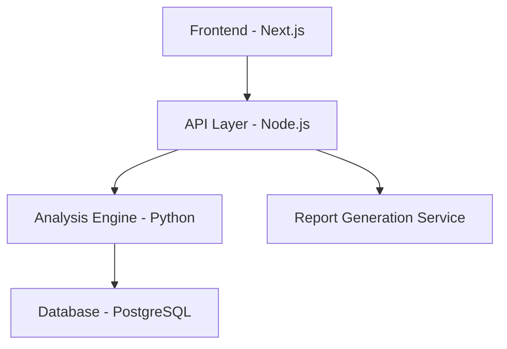

# Sniffer — Product Requirements Document

## Product Name

**Sniffer — Digital Media Authenticity Verification Platform**

---

## 1. Product Vision

Sniffer is a platform designed to help users verify whether an image has been manipulated or synthetically generated. The system performs multi-layer forensic analysis and produces a structured verification report with contextual evidence and reporting guidance.

The platform focuses on:

- Deepfake detection
- Image manipulation detection
- Evidence documentation
- Content reporting assistance

Version 1 focuses entirely on **image verification**.

Future versions will support:

- Video verification
- Audio verification
- Large-scale threat intelligence

---

## 2. Core Product Objectives

The platform must allow users to:

1. Upload suspicious images for verification
2. Compare against original reference images if available
3. Detect manipulation using hybrid analysis methods
4. Highlight suspicious regions visually
5. Generate structured evidence reports
6. Provide platform-specific takedown guidance
7. Allow users to register original images to protect them from misuse

---

## 3. Target Users

Primary users include:

- Victims of manipulated media
- Journalists verifying media
- Investigators and analysts
- Researchers
- General public verifying suspicious images

---

## 4. Product Scope

### Version 1 (Hackathon Build)

**Fully implemented:**

- Image verification workflow
- Reference comparison
- Referenceless detection
- C2PA verification
- Metadata analysis
- Tamper localization
- Authenticity scoring
- Evidence report generation
- Context evidence collection
- Platform reporting guidance
- Original image protection registry
- Dashboard analytics

**Not included in V1:**

- Full video deepfake detection
- Full audio deepfake detection
- Large-scale monitoring systems

---

## 5. System Architecture



---

## 6. Core User Flows

### Flow 1 — Verify Suspicious Image

```
Landing Page
↓
Create Verification Case
↓
Answer Context Questions
↓
Upload Suspicious Image
↓
Optional Reference Image
↓
Run Analysis Pipeline
↓
Generate Authenticity Score
↓
Display Tamper Visualization
↓
Generate Evidence Report
↓
Provide Reporting Guidance
```

### Flow 2 — Protect Original Images

```
Landing Page
↓
Protect Your Images
↓
Upload Original Image
↓
Generate Fingerprint Hash
↓
Store in Reference Registry
↓
Future Uploads Matched Against Registry
```

---

## 7. Landing Page Requirements

Landing page must include:

### Hero Section

- Headline
- Short description
- Primary CTA

**Example headline:**

> Verify Manipulated Images and Generate Evidence Reports

**Primary CTA:** Create Verification Case

**Secondary CTA:** Protect Your Images

### Additional Sections

- How the platform works
- Core features overview
- Privacy assurances
- Educational resources

---

## 8. Case Creation Flow

When user starts a case, the system asks the following questions.

### Question 1

**Do you want to report anonymously?**

- Yes
- No *(if "No", collect user email)*

### Question 2

**Where did you encounter this image?**

- WhatsApp
- Instagram
- Telegram
- Facebook
- X / Twitter
- Unknown website
- Other

### Question 3

**Is the image impersonating someone?**

- Yes
- No
- Not sure

### Question 4

**What type of harm does this content cause?**

- Harassment
- Reputation damage
- Fraud or scam
- Misinformation
- Other

### Question 5

**Optional case notes.**

> All answers must be stored as case evidence metadata.

---

## 9. Media Upload Requirements

**Users must upload:**

- Suspicious Image *(required)*
- Reference Image *(optional)*

**Supported formats:** `jpg`, `jpeg`, `png`, `webp`

**Maximum size:** 10 MB

**Upon upload, the system must generate:**

- File hash (SHA256)
- Image dimensions
- File size
- MIME type
- Timestamp

---

## 10. C2PA Provenance Verification

The system must check for Content Credentials (C2PA).

**Extract:**

- Creation tool
- Editing history
- Credential signature
- Credential presence

**Possible outputs:**

- Verified credentials
- Invalid credentials
- No credentials present

> This becomes a provenance signal.

---

## 11. Metadata Analysis

System must extract metadata using EXIF parsing.

**Checks include:**

- Metadata presence
- Editing software traces
- Camera model
- Compression anomalies

---

## 12. Image Analysis Pipeline

Pipeline differs based on reference availability.

### Reference-Based Detection

**Steps:**

1. Compute perceptual hash
2. Compare with reference hash
3. Calculate Hamming distance
4. Calculate SSIM similarity
5. Generate pixel difference map

**Output signals:**

- Similarity score
- Difference heatmap

### Referenceless Detection

If no reference is provided:

1. Perform frequency analysis
2. Run deepfake classifier
3. Detect blending artifacts
4. Detect compression inconsistencies

**Output signals:**

- Manipulation probability
- Artifact detection indicators

---

## 13. Authenticity Score System

System must combine signals into a unified score.

**Score range:** 0 – 100

**Interpretation:**

| Score | Risk Level |
|-------|------------|
| 0 – 30 | High manipulation risk |
| 31 – 60 | Medium risk |
| 61 – 100 | Low risk |

**Signals used:**

- C2PA result
- Metadata integrity
- Reference similarity
- Deepfake classifier score
- Frequency anomalies

---

## 14. Tamper Visualization

System must generate a visual tamper map.

**Implementation:**

- Pixel difference heatmap
- Bounding box extraction
- Suspicious regions displayed directly on the image

---

## 15. Explainable AI Output

System must generate a human-readable explanation.

**Example:**

> This image shows blending artifacts around facial boundaries and lacks authenticity credentials, suggesting potential synthetic manipulation.

**Explanation must reference:**

- Detected artifacts
- Metadata anomalies
- Provenance status

---

## 16. Evidence Report Generation

Users can download a Verification Report.

**Report structure:**

### Case Information
- Case ID
- Upload timestamp
- File hash
- Image metadata

### Context Evidence
- Platform where image was found
- Impersonation status
- Harm category
- Case notes

### Analysis Results
- Authenticity score
- Detection signals
- Tamper visualization
- Forensic explanation

---

## 17. Platform Reporting Guidance

Reports must include instructions for reporting based on the selected platform.

**Example:**

- **Instagram** — Steps for reporting manipulated media
- **WhatsApp** — Steps for reporting harmful content

Also include a link to the **Cybercrime reporting portal**.

---

## 18. Original Image Protection Registry

Users can upload original images.

**System must generate:**

- Perceptual fingerprint
- File hash

**Storage:** Stored in reference database.

> Future uploads should be checked against the registry.

---

## 19. Dashboard Requirements

Dashboard displays system analytics.

**Metrics include:**

- Total cases analyzed
- Manipulation rate
- Tamper type distribution
- Severity distribution
- C2PA credential presence

**Optional:**

- Regional visualization based on dataset

---

## 20. Database Schema

### Case

| Field | Description |
|-------|-------------|
| `case_id` | Unique case identifier |
| `created_at` | Creation timestamp |
| `file_hash` | SHA256 hash of uploaded file |
| `metadata` | Extracted image metadata |
| `platform_source` | Platform where image was found |
| `harm_category` | Type of harm reported |

### AnalysisResult

| Field | Description |
|-------|-------------|
| `case_id` | Reference to Case |
| `authenticity_score` | Score from 0–100 |
| `classification` | Risk classification |
| `tamper_regions` | Detected tamper region data |
| `explanation` | Human-readable forensic explanation |

### ReferenceImage

| Field | Description |
|-------|-------------|
| `reference_id` | Unique reference identifier |
| `file_hash` | SHA256 hash of original image |
| `image_fingerprint` | Perceptual hash fingerprint |
| `created_at` | Registration timestamp |

---

## 21. Security Requirements

System must:

- Hash all uploaded files
- Avoid storing unnecessary personal data
- Allow anonymous case creation

---

## 22. Performance Requirements

**Target analysis time:** 30 – 60 seconds

---

## 23. Future Expansion

### Phase 2 — Video Deepfake Detection

- Frame sampling analysis
- Temporal inconsistency detection

### Phase 3 — Audio Deepfake Detection

- Spectrogram artifact detection
- Voice synthesis indicators

### Phase 4 — Large-Scale Monitoring

- Large-scale media monitoring
- Threat intelligence

---

## 24. Design Principles

The platform must prioritize:

- **Transparency** — Clear and open analysis outputs
- **Explainability** — Human-readable forensic explanations
- **Structured outputs** — Consistent, well-defined report formats
- **Actionable insights** — Guidance that enables real-world response

> The goal is to transform AI detection outputs into investigation-ready verification workflows.
````---
